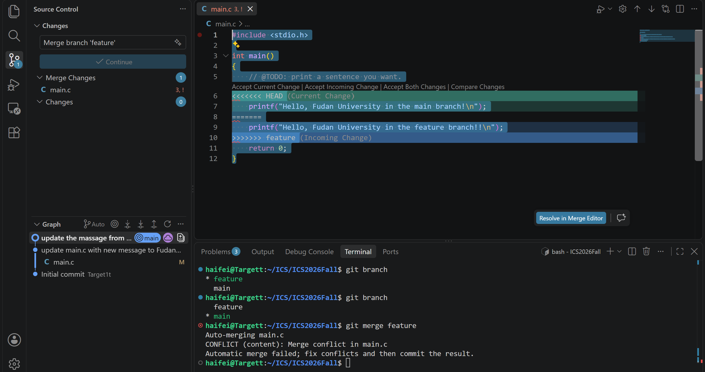

# 一、Git问题

## 1. 之前有过多人协同开发经历吗？如果有，如何分工协作？

没有

---

## 2. Git 为什么设计“暂存-提交”两个步骤？

Git 将修改分为暂存（stage）和提交（commit）两个步骤，是为了提高版本管理的灵活性。

如果修改文件后直接提交，那么所有修改都会进入同一个版本。

## 3. git branch 和 git branch -a 的区别？
`git branch` 用于查看本地分支。

`git branch -a` 会显示所有分支，包括本地分支和远程分支。

# 二、你对“为什么要学习 Git”这个问题的理解
Git版本管理文件适应现代化的多人协作、敏捷地软件开发。对于过往版本的追溯使得软件更新有迹可循

# 三、实验步骤
1. 建立SSH链接并克隆Github仓库
2. 下载Github仓库到本地
3. 修改主分支的`main.c`并提交
4. 创建新分支并在`main`和`feature`中同时修改，产生冲突并解决，随后合并分支
